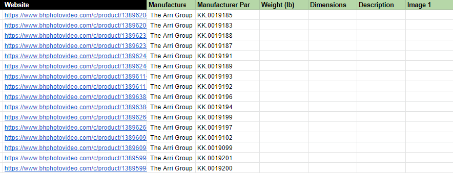
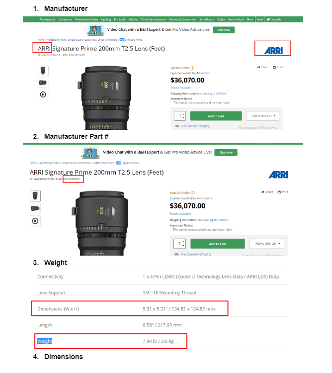
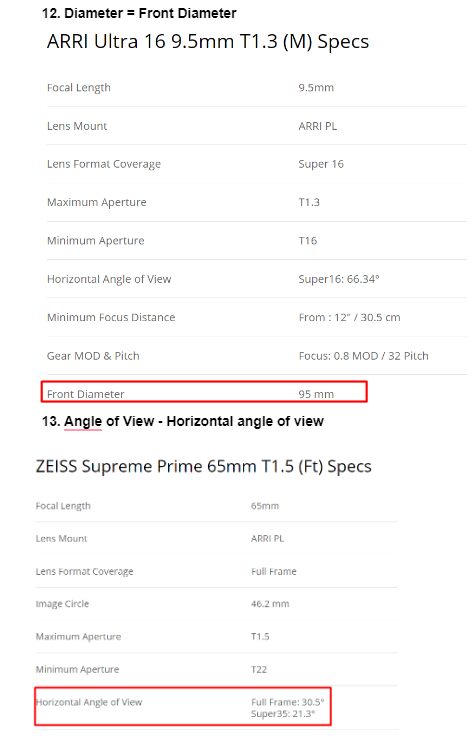

# datascraper

## description
The project aims to extract public content from trusted web sources and then analyze it. 
There are 3 web sources for scraping with 3 categories in each.

---
## implemented web sources
-   [B&H](https://www.bhphotovideo.com/c/product/1505274-REG/red_digital_cinema_710_0329_red_ranger_with_helium.html)
-   [AbelCine](https://www.abelcine.com/rent/lenses-accessories/cine-lenses/kowa-50mm-cine-prominar-anamorphic-t23-prime-pl-mount)
-   [Adorama](https://www.adorama.com/coeasf40.html)

---
## examples
### input/output file
The input file contains links for scraping, the client provided this information, and the output is a CSV file that contains all the required data.

---
### source fields
To be sure we get all the data properly we helped the client to prepare a document with screenshots 
of the scraping fields and their mapping.

---
### note
It was one-time data delivery and for scraping, we used proxies since one of the websites detected our activity. 

